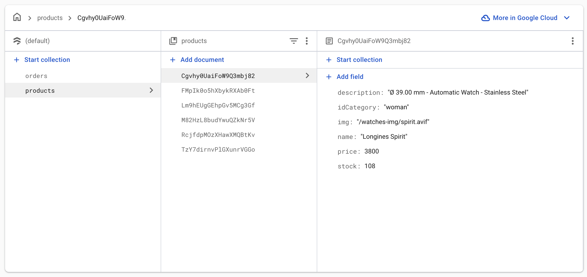
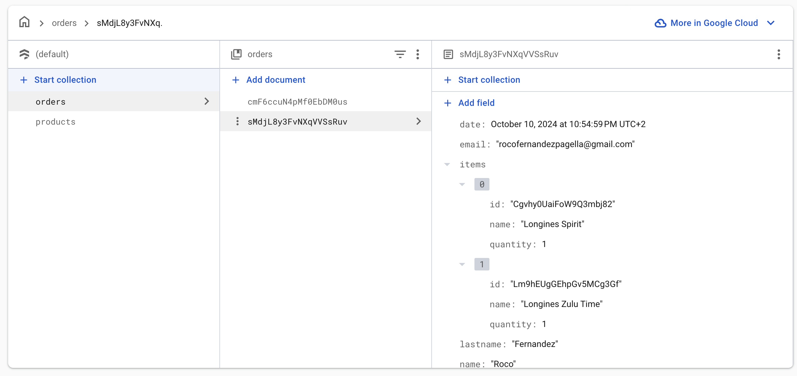

# Longines Watch Ecommerce
## [By Roco Fernandez Pagella](https://roco-fernandez-p.web.app/)
### [See the web live here](https://chipper-bienenstitch-e785de.netlify.app/) 

A modern and responsive e-commerce platform for purchasing luxury watches, built with React.

## Features
- Responsive Design: Mobile-friendly design for a seamless shopping experience across all devices.
- Product Search & Filtering: Easily search and filter watches by category, brand, or price.
- Shopping Cart: Add products to a cart, adjust quantities, and view totals in real-time.
- Cloud Storage: Store and manage images and product data using Firebase.


## Technologies
- React: Frontend library for building the user interface.
- Firebase: Backend as a Service (BaaS) for NoSQL database for storing product data.
React Router: For navigating between pages.
CSS Modules/Styled Components: For styling the application.

## Firebase example





## Installation
### Prerequisites
Ensure you have Node.js and npm installed.

### Clone the repository:

```bash
git clone https://github.com/Rockstar2K/watch-ecommerce.git


### Navigate to the project directory:

```bash
cd watchify

### Install the dependencies:

```bash
npm install

### Set up environment variables. Create a .env file in the root directory with your environment-specific keys:

```bash
REACT_APP_API_URL=your_api_url
REACT_APP_STRIPE_KEY=your_stripe_key

## Usage
### To run the app in development mode:

```bash
npm run dev